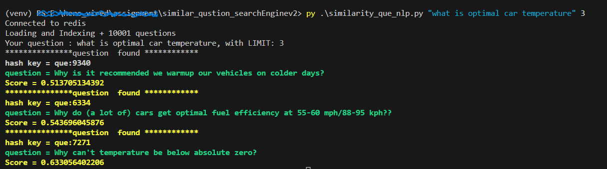

# Semantic Search NLP v2.0
> Build CLI application to find text similarity.

## Table of Contents
* [General Info](#general-information)
* [Technologies Used](#technologies-used)
* [Result](#result)
* [Conclusions](#conclusions)
* [Contact](#contact)

## General Information
- We developed a CLI application based on NLP concepts that finds the top similar text/questions to the user-provided input. 
- We use pre-trained sentence transformer ``sentence-transformers/all-distilroberta-v1`` available at ``hugging face``. 
- How it works:
  1. This project uses the subset of the famous ELI5 dataset. 
  2. Then We have perform vector embedding on ``question`` column and store it in ``redis-vector-database`` .
  3. After that it convert user input ``query(question)``. 
  4. Based on ``cosine similarity`` it will find out ``top 5(or user provide limit)`` similar question. 

- How to use:
  1. step_1: run ``docker-compose up`` command. 
  2. step_2: run ``py similarity_que_nlp.py "your question" 5`` (for top 5 similar que you can play around this limit).
  3. step_3: to stop container ``docker stop your_container_id``. 
  
## Result
 

## Conclusions
- We will get core understanding of how Sentence transformer work.
- Get hands on experience with latest redis vector database. 
- How cosine similarity works in action. 

## Technologies Used
- numpy 
- pandas 
- NLP
- Redis Vector Database
- hugging face
- sentence-transformer

## Contact
Created by [@impc043] - feel free to reach out!